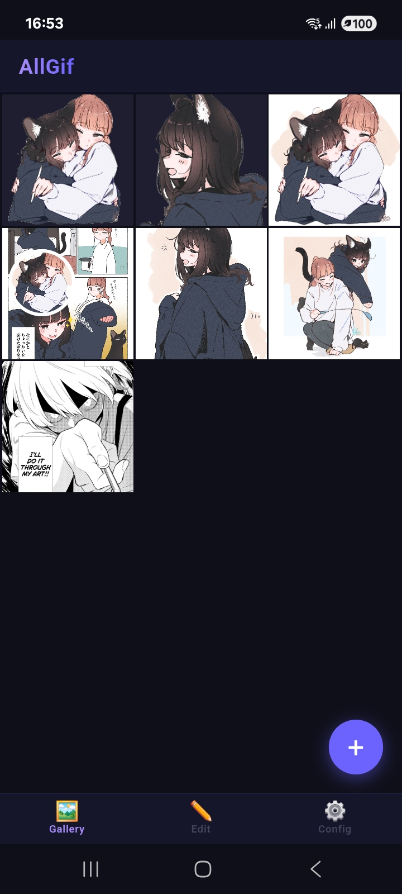
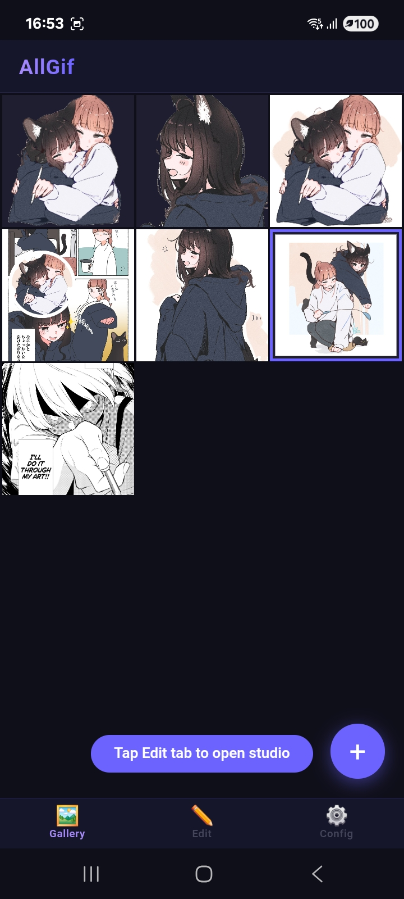
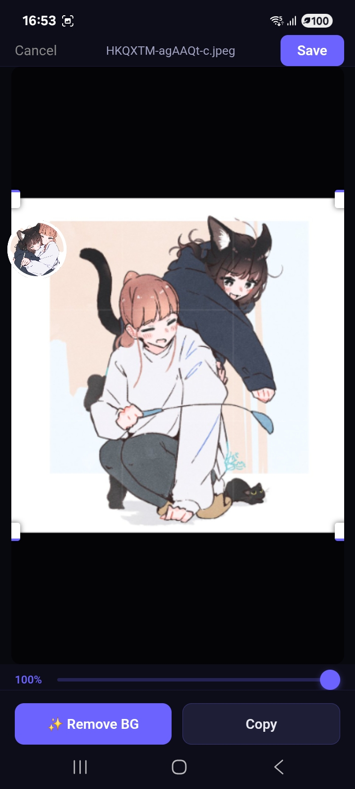
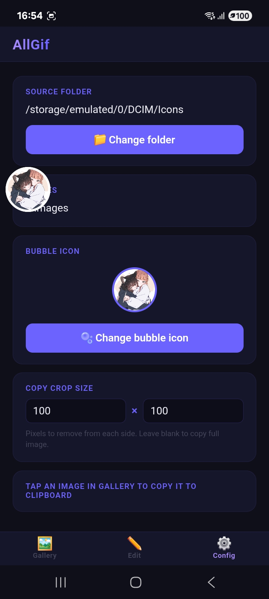
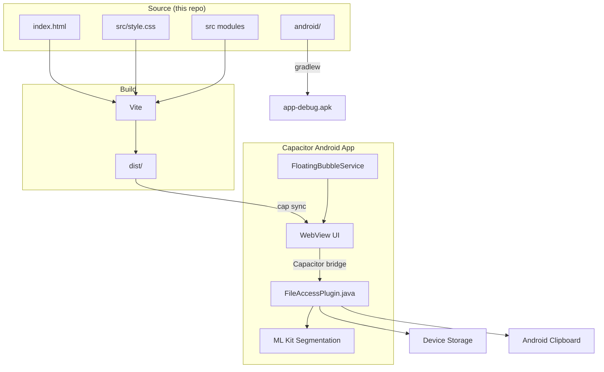
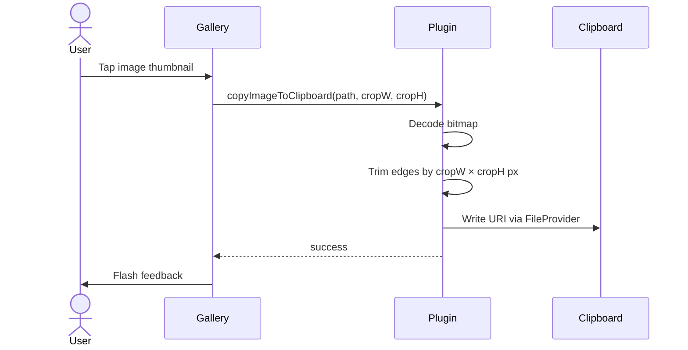
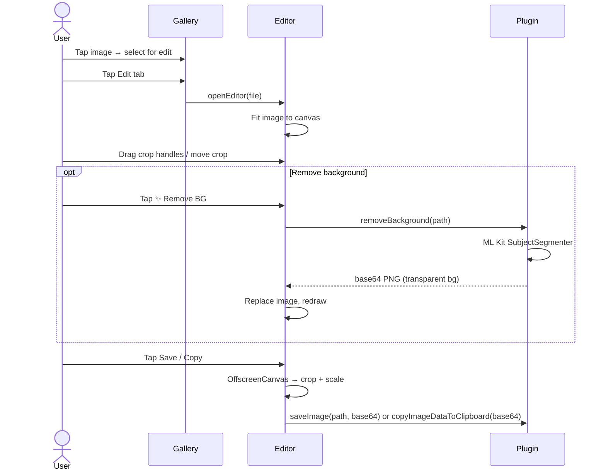
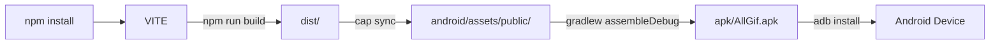

# AllGif — Android Image Browser & Editor

[](https://github.com/nguyenkhang-gif/allgif-android/releases/latest/download/AllGif.apk)

App images (logo, background) by [@M_terU116](https://x.com/M_terU116).

AllGif lets you browse images from any folder on your Android device, copy them to the clipboard with a single tap, and edit them in a built-in studio — crop freely and remove backgrounds on-device with ML Kit.

Available as a native Android app (Capacitor) with a floating bubble for quick access from any app.

---

## Screenshots

| Gallery | Select for Edit | Editor Studio | Config |
|:---:|:---:|:---:|:---:|
|  |  |  |  |

---

## Tech Stack

| Layer | Technology |
|---|---|
| UI | Vanilla JS + CSS (no framework) |
| Bundler | Vite 8 |
| Native bridge | Capacitor 8 |
| Image processing | Android `android.graphics.Bitmap` |
| Background removal | ML Kit Subject Segmentation (on-device) |
| File access | Custom Java plugin (`FileAccessPlugin`) |
| Clipboard | Android `ClipboardManager` + `FileProvider` |
| Android build | Gradle + `adb` |

---

## Architecture



---

## Copy Flow



---

## Edit Flow



---

## Build Pipeline



---

## Requirements

- Node.js 18+
- Java 21 (`/opt/homebrew/opt/openjdk@21`)
- Android SDK (`~/Library/Android/sdk`)
- Android device with USB debugging enabled

---

## Setup

```bash
npm install
```

No `.env` needed — AllGif has no API keys. All processing runs on-device.

---

## Running on Web

```bash
npm run dev
```

Opens a local Vite dev server. Note: native features (file access, clipboard, ML Kit) require the Android build.

---

## Building & Installing on Android

### Build + install to connected device

```bash
npm run run
```

### Build APK only (saved to `apk/AllGif.apk`)

```bash
npm run apk
```

### Sync web assets without full rebuild

```bash
npm run sync
```

### Open in Android Studio

```bash
npm run open
```

---

## Viewing device logs

```bash
npm run log
```

Streams only AllGif's logs, filtering out system noise.

---

## Features

- **3-column image grid** — lazy-loaded thumbnails via IntersectionObserver, memory-efficient
- **One-tap clipboard copy** — tap any image to copy it; optional edge-trim crop configured per-pixel
- **Configurable crop** — set pixels to remove from each edge before copying (Config tab)
- **Floating bubble** — persistent overlay bubble for quick gallery access from any app
- **Custom bubble icon** — set any image from your gallery as the bubble icon
- **Folder picker** — browse and select any folder from device storage
- **Image editor** — canvas-based crop UI with draggable handles and rule-of-thirds grid
- **Background removal** — on-device ML Kit Subject Segmentation, no network required
- **Output size slider** — scale down the exported image (10%–100%) before saving or copying
- **Save edited images** — overwrites original or saves as PNG (after background removal)
- **Edge-to-edge UI** — status bar and gesture navigation bar insets injected from Java into CSS

---

## File Structure

```
allgif-android/
├── src/
│   ├── main.js         # Entry point — gallery, tabs, copy logic
│   ├── editor.js       # Image editor — canvas crop, drag handles, export
│   ├── filesystem.js   # FileAccess plugin bridge + web stubs
│   └── style.css       # All CSS
├── index.html            # HTML shell
├── android/
│   └── app/src/main/java/com/allgif/app/
│       ├── MainActivity.java       # Edge-to-edge insets, permission chain
│       ├── FileAccessPlugin.java   # File list, copy, crop, ML Kit, save
│       └── FloatingBubbleService.java
├── assets/               # Screenshots
├── capacitor.config.json
├── vite.config.js
└── package.json
```

---

## What's committed vs generated

| Path | Committed | Reason |
|---|---|---|
| `src/`, `index.html` | ✅ | Source code |
| `android/` | ✅ | Native customisations (plugin, MainActivity, icons) |
| `assets/` | ✅ | Screenshots |
| `capacitor.config.json`, `vite.config.js`, `package.json` | ✅ | Config |
| `node_modules/`, `dist/`, `apk/` | ❌ | Generated at build time |
| `android/.gradle/`, `android/app/build/` | ❌ | Gradle build cache |
| `android/app/src/main/assets/public/` | ❌ | Synced by `cap sync` |

---

## Credits

App images (logo, background) by [@M_terU116](https://x.com/M_terU116).

---

## Troubleshooting

**`adb: no devices found`**
Enable USB debugging (Settings → Developer Options → USB Debugging) and accept the trust prompt on the device.

**All files permission denied**
AllGif requests "All files access" on first launch. Go to Android Settings → Apps → AllGif → Permissions and grant it, or tap Grant on the in-app dialog.

**Floating bubble not appearing**
AllGif needs "Display over other apps" permission. Go to Android Settings → Apps → AllGif → Display over other apps and enable it.

**Background removal fails**
ML Kit downloads the segmentation model on first use — ensure the device is online for the initial download. Subsequent removals work offline.

**Java not found during build**
The npm scripts export `JAVA_HOME` automatically. If running Gradle directly:
```bash
export JAVA_HOME=/opt/homebrew/opt/openjdk@21
export PATH="$JAVA_HOME/bin:$PATH"
```
