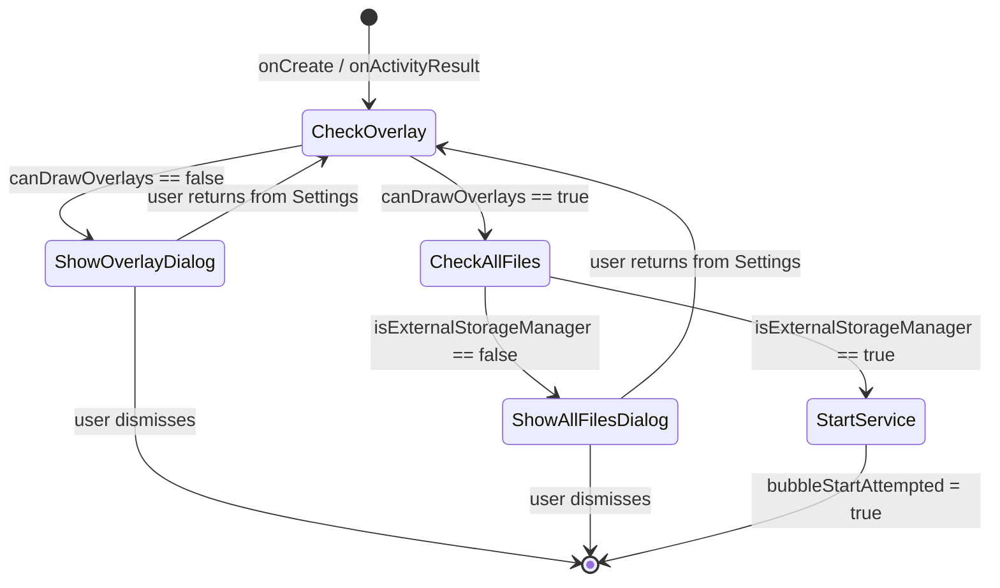
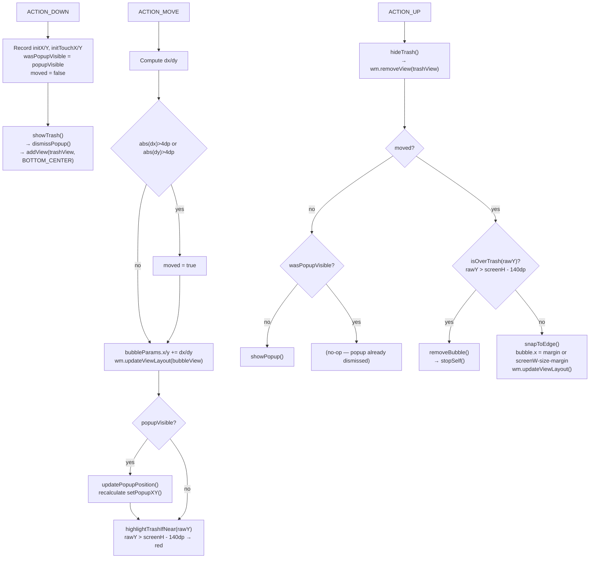
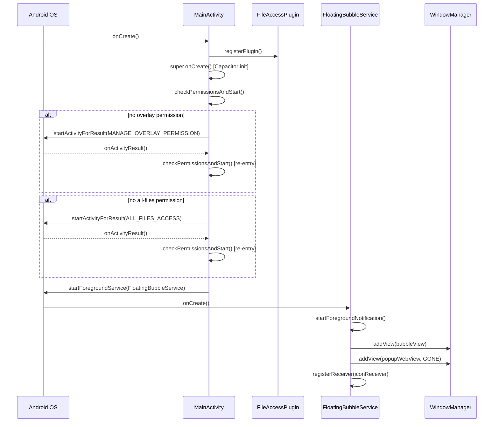
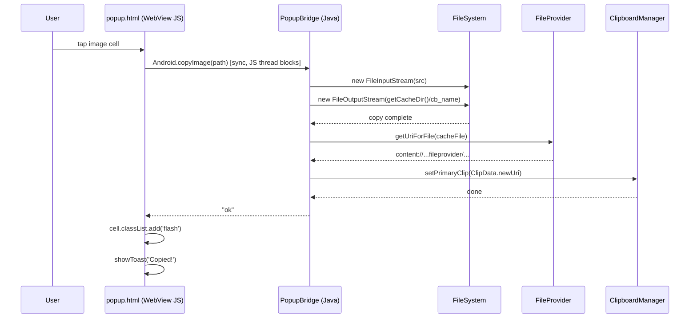
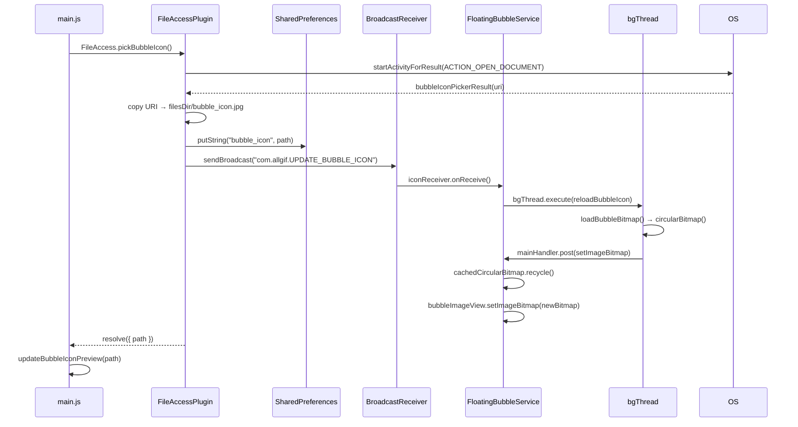
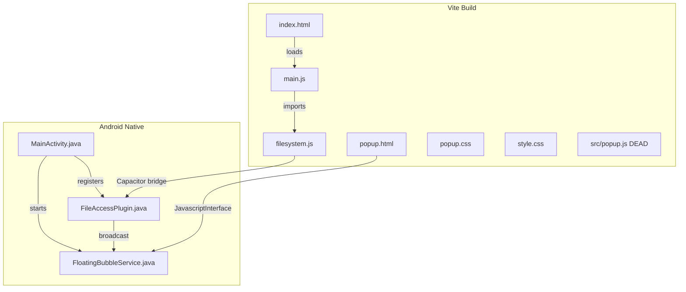

# AllGif Android — Architecture Audit

> **Audit date:** 2026-06-10  
> **Auditor:** Principal-level architecture review (automated)  
> **Scope:** `allgif-android/` directory — all source layers

---

## Table of Contents

1. [Architecture Overview](#1-architecture-overview)
2. [Layer & Module Responsibilities](#2-layer--module-responsibilities)
3. [Dependency Direction & Diagram](#3-dependency-direction--diagram)
4. [Feature-by-Feature Breakdown](#4-feature-by-feature-breakdown)
   - 4.1 [Permission Bootstrapping](#41-permission-bootstrapping)
   - 4.2 [Floating Bubble Lifecycle](#42-floating-bubble-lifecycle)
   - 4.3 [Bubble Drag, Snap & Trash](#43-bubble-drag-snap--trash)
   - 4.4 [Popup WebView Toggle](#44-popup-webview-toggle)
   - 4.5 [Folder Picker](#45-folder-picker)
   - 4.6 [Image Gallery (Main App)](#46-image-gallery-main-app)
   - 4.7 [Image Copy to Clipboard](#47-image-copy-to-clipboard)
   - 4.8 [Bubble Icon Customisation](#48-bubble-icon-customisation)
   - 4.9 [Popup Gallery (Overlay)](#49-popup-gallery-overlay)
   - 4.10 [Thumbnail Generation](#410-thumbnail-generation)
5. [Use-Case Catalog](#5-use-case-catalog)
6. [System Flow Diagrams](#6-system-flow-diagrams)
7. [Risk Analysis & Code Smells](#7-risk-analysis--code-smells)
8. [Architecture Quality Assessment](#8-architecture-quality-assessment)
9. [Refactor Recommendations](#9-refactor-recommendations)
10. [Final Architecture Score](#10-final-architecture-score)

---

## 1. Architecture Overview

AllGif is a **hybrid Android application** composed of two distinct rendering contexts running simultaneously on a single device:

| Surface | Technology | Entry Point | Bridge |
|---|---|---|---|
| Main App | Capacitor 8 WebView (`BridgeActivity`) | `index.html` → `src/main.js` | `FileAccess` Capacitor plugin |
| Floating Popup | Plain Android WebView (WindowManager overlay) | `popup.html` (inline JS) | `PopupBridge` `JavascriptInterface` |

**Architecture style:** **Hybrid Layered + Event-driven (minimal)**

- There is no Clean Architecture, no hexagonal ports/adapters, and no CQRS. The project is deliberately small and flat.
- The closest named pattern is **two-tier**: a presentation layer (HTML/CSS/JS) calling a thin native adapter layer (Java).
- The only event-driven element is the `LocalBroadcast` used to propagate bubble icon changes from `FileAccessPlugin` → `FloatingBubbleService`.

**Build pipeline:**

```
src/  +  index.html  +  popup.html
          │
          ▼  npm run build  (Vite 8, multi-page)
        dist/
          │
          ▼  cap sync android
  android/app/src/main/assets/public/
          │
          ▼  ./gradlew assembleDebug
        app-debug.apk
          │
          ▼  adb install -r
      Android device
```

---

## 2. Layer & Module Responsibilities

### 2.1 Web Layer (Vite / Vanilla JS)

| File | Role |
|---|---|
| `index.html` | HTML shell for main Capacitor app — declares two-tab layout (Gallery, Config) |
| `src/main.js` | Main app controller — owns tab switching, image grid rendering, lazy loading, folder/bubble-icon picking, clipboard copy via Capacitor plugin |
| `src/style.css` | Full dark-theme stylesheet for main app |
| `popup.html` | Standalone HTML + inline JS for the floating overlay popup — no Vite module system |
| `src/popup.js` | **DEAD FILE** — earlier iteration of popup logic, superseded by the inline `<script>` in `popup.html`. Never imported anywhere. |
| `src/popup.css` | Stylesheet for the popup card |
| `src/filesystem.js` | Capacitor plugin registration + thin wrapper functions (`listFiles`, `readFile`, `getStorageRoots`) |

### 2.2 Build / Config Layer

| File | Role |
|---|---|
| `vite.config.js` | Multi-page Vite build — two `rollupOptions.input` entries; `base: './'` is critical for `file://` asset resolution inside Android WebView |
| `capacitor.config.json` | Capacitor app metadata — `appId`, `webDir: "dist"`, `androidScheme: "https"` |
| `package.json` | NPM scripts for build, sync, APK generation, ADB install, and logcat streaming |

### 2.3 Native Android Layer

| File | Role |
|---|---|
| `MainActivity.java` | `BridgeActivity` subclass — sequential permission chain (overlay → all-files → start service), registers `FileAccessPlugin` |
| `FileAccessPlugin.java` | Capacitor `@CapacitorPlugin` — exposes `listFiles`, `readFile`, `getStorageRoots`, `syncFolder`, `pickFolder`, `pickBubbleIcon`, `copyImageToClipboard` to the main Capacitor WebView |
| `FloatingBubbleService.java` | `ForegroundService` — owns the entire overlay UI: `bubbleView` (ImageView), `popupWebView` (WebView), `trashView` (TextView), touch handling, snap-to-edge, `PopupBridge` inner class |

### 2.4 Android Resources

| File | Role |
|---|---|
| `AndroidManifest.xml` | Declares permissions (SYSTEM_ALERT_WINDOW, MANAGE_EXTERNAL_STORAGE, etc.), `FloatingBubbleService`, `FileProvider` |
| `res/xml/file_paths.xml` | FileProvider paths — `external-path path="."` (all external storage), `cache-path path="."` (all cache) |
| `res/xml/config.xml` | Cordova/Capacitor config — `<access origin="*" />` |

---

## 3. Dependency Direction & Diagram

```
┌─────────────────────────────────────────────────────────────┐
│                     Android Runtime                          │
│                                                              │
│   ┌──────────────────────────┐                              │
│   │       MainActivity        │                              │
│   │  (BridgeActivity subclass)│                              │
│   │                          │                              │
│   │  registers FileAccessPlugin                              │
│   │  checks permissions       │                              │
│   │  startForegroundService ──┼──────────────────────┐       │
│   └──────────┬───────────────┘                       │       │
│              │ hosts                                  ▼       │
│   ┌──────────▼───────────────┐    ┌──────────────────────┐  │
│   │   Capacitor WebView       │    │  FloatingBubbleService│  │
│   │   (index.html / main.js)  │    │                      │  │
│   │                          │    │  ┌────────────────┐   │  │
│   │  ◄──── FileAccess ───────┼────┼──┤  bubbleView    │   │  │
│   │       Capacitor Plugin    │    │  │  (ImageView)   │   │  │
│   └──────────────────────────┘    │  └────────────────┘   │  │
│                                   │  ┌────────────────┐   │  │
│                                   │  │  popupWebView  │   │  │
│                                   │  │  (WebView)     │   │  │
│                                   │  │  popup.html    │   │  │
│                                   │  │  ◄─PopupBridge─┼───┼──┤
│                                   │  └────────────────┘   │  │
│                                   │  ┌────────────────┐   │  │
│                                   │  │  trashView     │   │  │
│                                   │  │  (TextView)    │   │  │
│                                   │  └────────────────┘   │  │
│                                   │                      │  │
│                                   │  bgThread (Executor)  │  │
│                                   │  mainHandler          │  │
│                                   └──────────────────────┘  │
│                                                              │
│   ┌──────────────────────────────────────────────────────┐  │
│   │                   WindowManager                       │  │
│   │  TYPE_APPLICATION_OVERLAY — all three overlay views   │  │
│   └──────────────────────────────────────────────────────┘  │
│                                                              │
│   LocalBroadcast: "com.allgif.UPDATE_BUBBLE_ICON"           │
│   FileAccessPlugin ──────────────────► FloatingBubbleService│
└─────────────────────────────────────────────────────────────┘
```

**Dependency arrows:**

- `MainActivity` → `FileAccessPlugin` (registers at onCreate)
- `MainActivity` → `FloatingBubbleService` (starts via Intent)
- `src/main.js` → `src/filesystem.js` → Capacitor bridge → `FileAccessPlugin`
- `popup.html` (inline JS) → `window.Android` → `PopupBridge` (inner class of `FloatingBubbleService`)
- `FileAccessPlugin` →→ `FloatingBubbleService` (indirectly, via broadcast `com.allgif.UPDATE_BUBBLE_ICON`)

**No circular dependencies detected.**

---

## 4. Feature-by-Feature Breakdown

### 4.1 Permission Bootstrapping

**Entry point:** `MainActivity.onCreate()` → `checkPermissionsAndStart()`

**Execution path:**

```
MainActivity.onCreate()
  │
  ├─ registerPlugin(FileAccessPlugin.class)      // must be before super.onCreate()
  ├─ super.onCreate()                             // Capacitor bridge init
  ├─ WindowCompat.setDecorFitsSystemWindows(...)  // edge-to-edge layout
  └─ checkPermissionsAndStart()
       │
       ├─ Settings.canDrawOverlays(this)?
       │    NO → showOverlayDialog()
       │          AlertDialog → startActivityForResult(ACTION_MANAGE_OVERLAY_PERMISSION, 1001)
       │          onActivityResult → checkPermissionsAndStart()  [re-entry]
       │
       ├─ hasAllFilesPermission()?
       │    SDK >= R → Environment.isExternalStorageManager()
       │    SDK < R  → returns true (manifest-granted READ_EXTERNAL_STORAGE)
       │    NO → showAllFilesDialog()
       │          AlertDialog → startActivityForResult(ACTION_MANAGE_APP_ALL_FILES_ACCESS_PERMISSION, 1002)
       │          onActivityResult → checkPermissionsAndStart()  [re-entry]
       │
       └─ startBubbleService()
            if (!bubbleStartAttempted && !FloatingBubbleService.isRunning)
              startForegroundService(FloatingBubbleService)
```

**State machine:**



**Issues:**
- `onResume` guard `!bubbleStartAttempted` prevents re-start, but `bubbleStartAttempted` is never reset if the service crashes and `isRunning` becomes `false`. The service would never restart without an app restart.

---

### 4.2 Floating Bubble Lifecycle

**Entry point:** `startForegroundService(new Intent(this, FloatingBubbleService.class))`

**onCreate execution path:**

```
FloatingBubbleService.onCreate()
  │
  ├─ isRunning = true
  ├─ startForegroundNotification()
  │    creates NotificationChannel "allgif_bubble"
  │    posts NotificationCompat with PendingIntent → MainActivity
  │    startForeground(1, notification)
  │
  ├─ wm = getSystemService(WINDOW_SERVICE)
  │
  ├─ createBubble()
  │    creates ImageView (64dp × 64dp)
  │    sets foreground ring drawable (white oval stroke)
  │    bgThread.execute → loadBubbleBitmap() → circularBitmap() → mainHandler.post(iv.setImageBitmap)
  │    creates WindowManager.LayoutParams (TYPE_APPLICATION_OVERLAY, FLAG_NOT_FOCUSABLE)
  │    sets OnTouchListener
  │    wm.addView(bubbleView, bubbleParams)
  │
  ├─ createPopupWebView()
  │    creates WebView
  │    setJavaScriptEnabled(true)
  │    setAllowFileAccessFromFileURLs(true)   ← security note
  │    setAllowUniversalAccessFromFileURLs(true) ← security note
  │    addJavascriptInterface(new PopupBridge(), "Android")
  │    loadUrl("file:///android_asset/public/popup.html")
  │    setVisibility(GONE)
  │    wm.addView(popupWebView, popupParams)
  │
  └─ registerReceiver(iconReceiver, "com.allgif.UPDATE_BUBBLE_ICON", RECEIVER_NOT_EXPORTED)
```

**onDestroy execution path:**

```
FloatingBubbleService.onDestroy()
  │
  ├─ isRunning = false
  ├─ unregisterReceiver(iconReceiver)
  ├─ bgThread.shutdownNow()
  ├─ hideTrash()      // wm.removeView(trashView) if present
  ├─ wm.removeView(popupWebView) + popupWebView.destroy() + null
  ├─ wm.removeView(bubbleView)
  └─ cachedCircularBitmap.recycle()
```

---

### 4.3 Bubble Drag, Snap & Trash

**Touch listener on `bubbleView` (`FloatingBubbleService.java:139`):**



---

### 4.4 Popup WebView Toggle

**Show popup (`FloatingBubbleService.java:260`):**

```
showPopup()
  │
  ├─ setPopupXY(pp)           // compute x/y relative to bubble position
  │    idealY = bubbleY - popH - 8dp
  │    if idealY < margin → use bubbleY + 72dp (below bubble)
  │    clamp to [margin, screenH - popH - margin]
  │    idealX = bubbleX + 32dp - popW/2
  │    clamp to [margin, screenW - popW - margin]
  │
  ├─ wm.updateViewLayout(popupWebView, params)
  ├─ popupWebView.setVisibility(VISIBLE)
  ├─ popupWebView.evaluateJavascript("if(window.reload)reload();", null)
  └─ popupVisible = true
```

**Dismiss popup:**

```
dismissPopup()
  ├─ popupWebView.setVisibility(GONE)
  └─ popupVisible = false
```

**WebView stays alive** — created once in `onCreate`, toggled via visibility. `evaluateJavascript("reload()")` re-runs `init()` in `popup.html` to refresh the image list when the popup reopens.

---

### 4.5 Folder Picker

**Entry point:** `btnChange.click` → `openFolderPicker()` in `src/main.js:114`

```
JS: FileAccess.pickFolder()        // calls Capacitor bridge
  │
  ▼
FileAccessPlugin.pickFolder()      // FileAccessPlugin.java:117
  │
  ├─ Intent(ACTION_OPEN_DOCUMENT_TREE) + FLAG_GRANT_READ_URI_PERMISSION
  └─ startActivityForResult(call, intent, "folderPickerResult")
       │
       ▼  user picks folder in system UI
       │
  folderPickerResult(call, result)  // FileAccessPlugin.java:124
       │
       ├─ if RESULT_CANCELLED → call.reject("Cancelled")
       ├─ uri = result.getData()
       ├─ path = uriToPath(uri)
       │    content://...primary:DCIM → /storage/emulated/0/DCIM
       │    content://...XXXX-XXXX:path → /storage/XXXX-XXXX/path
       │    fallback → uri.toString()
       │
       ├─ SharedPreferences("allgif").putString("folder", path)   ← shared with popup
       └─ call.resolve({ path })
            │
            ▼
JS: selectedFolder = path
    localStorage.setItem('allgif_folder', path)
    FileAccess.syncFolder({ path })   // redundant — also writes SharedPrefs
    updateConfigUI(path)
    loadImages(path)
    switch tab to "gallery"
```

**State synced to:** `localStorage` (main WebView), `SharedPreferences("allgif")` (popup bridge reads this).

**Issue:** `syncFolder` is called from JS immediately after `folderPickerResult` already wrote to SharedPrefs — double write, functionally harmless but redundant.

---

### 4.6 Image Gallery (Main App)

**Entry point:** `loadImages(path)` in `src/main.js:49`

```
loadImages(path)
  │
  ├─ grid.innerHTML = ''
  ├─ disconnect lazyObserver if exists
  ├─ showEmpty('Loading…')
  │
  ├─ listFiles(path)            // src/filesystem.js:30
  │    FileAccess.listFiles({ path })
  │      ▼
  │    FileAccessPlugin.listFiles()    // FileAccessPlugin.java:33
  │      dir.listFiles()               // synchronous disk scan
  │      returns [{ name, path, isDirectory, size, lastModified }]
  │
  ├─ filter: !isDirectory && IMAGE_EXT.test(name)   // /\.(gif|jpg|jpeg|png|webp|bmp)$/i
  ├─ sort: descending by lastModified
  │
  ├─ if 0 images → showEmpty('No images found…'); return
  │
  ├─ hideEmpty()
  │
  ├─ create IntersectionObserver (rootMargin: 300px)
  │    on intersect: img.src = img.dataset.src; delete dataset.src; unobserve
  │
  └─ for each image:
       cell = div.grid-cell
       img.dataset.src = Capacitor.convertFileSrc(file.path)
       lazyObserver.observe(img)
       cell.click → copyImage(file.path, cell)
       grid.appendChild(cell)
```

**Image URL conversion:** `Capacitor.convertFileSrc` maps `/storage/emulated/0/...` to `https://localhost/_capacitor_file_/storage/emulated/0/...` — required because the Capacitor WebView uses `androidScheme: "https"`, so `file://` URLs are blocked by CORS.

---

### 4.7 Image Copy to Clipboard

**Path A — Main App (Capacitor):**

```
JS: FileAccess.copyImageToClipboard({ path })
      ▼
FileAccessPlugin.copyImageToClipboard()   // FileAccessPlugin.java:197
  │
  ├─ File src = new File(path)
  ├─ File cacheFile = new File(getCacheDir(), "cb_" + src.getName())
  ├─ copy src → cacheFile  (8KB buffer)
  │
  ├─ Uri uri = FileProvider.getUriForFile(ctx, "com.allgif.app.fileprovider", cacheFile)
  │
  └─ ClipboardManager.setPrimaryClip(ClipData.newUri(..., uri))
       call.resolve()
```

**Path B — Popup WebView (JavascriptInterface):**

```
JS: Android.copyImage(file.path)     // synchronous call on JS thread
      ▼
PopupBridge.copyImage(path)          // FloatingBubbleService.java:374
  │
  ├─ File src = new File(path)
  ├─ File cacheFile = new File(getCacheDir(), "cb_" + src.getName())
  ├─ copy src → cacheFile  (8KB buffer)
  │
  ├─ Uri uri = FileProvider.getUriForFile(...)
  └─ ClipboardManager.setPrimaryClip(...)
       returns "ok" | "error:..."
```

**Issue:** Both paths use the **same cache filename strategy** (`"cb_" + src.getName()`). If two images from different folders have the same filename, the cache entry is overwritten silently. A copied file from path A can be replaced by the version from path B before the clipboard consumer reads it.

---

### 4.8 Bubble Icon Customisation

**Entry point:** `btnChangeBubble.click` → `openBubbleIconPicker()` in `src/main.js:134`

```
JS: FileAccess.pickBubbleIcon()
      ▼
FileAccessPlugin.pickBubbleIcon()    // FileAccessPlugin.java:160
  │
  ├─ Intent(ACTION_OPEN_DOCUMENT) + CATEGORY_OPENABLE + type="image/*"
  └─ startActivityForResult(call, intent, "bubbleIconPickerResult")
       │
  bubbleIconPickerResult()           // FileAccessPlugin.java:168
       │
       ├─ if cancelled → call.reject("Cancelled")
       ├─ File dest = new File(getContext().getFilesDir(), "bubble_icon.jpg")
       ├─ copy from ContentResolver URI → dest  (8KB buffer)
       ├─ SharedPreferences("allgif").putString("bubble_icon", dest.getAbsolutePath())
       │
       ├─ sendBroadcast("com.allgif.UPDATE_BUBBLE_ICON")
       │     ▼
       │   FloatingBubbleService.iconReceiver.onReceive()
       │     reloadBubbleIcon()
       │       bgThread.execute → loadBubbleBitmap() → circularBitmap()
       │       mainHandler.post → cachedCircularBitmap.recycle(); set new bitmap
       │
       └─ call.resolve({ path: dest.getAbsolutePath() })
            │
            ▼
JS: bubbleIconPath = path
    localStorage.setItem('allgif_bubble_icon', path)
    updateBubbleIconPreview(path)    // bubbleIconPreview.src = Capacitor.convertFileSrc(path)
```

---

### 4.9 Popup Gallery (Overlay)

**Entry point:** `init()` in `popup.html` inline script (not `src/popup.js` — that file is dead)

```
init()
  │
  ├─ if !window.Android → show "No bridge"; return
  │
  ├─ folder = Android.getFolder()         // synchronous, reads SharedPreferences
  ├─ if !folder → show "Open AllGif…"; return
  │
  ├─ images = JSON.parse(Android.listImages(folder))   // synchronous, scans disk
  │    PopupBridge.listImages()
  │      dir.listFiles()
  │      sort descending by lastModified
  │      JSON string builder — capped at 60 entries
  │      returns JSON string
  │
  ├─ if empty → show "No images…"; return
  │
  ├─ create IntersectionObserver (rootMargin: 200px)
  │    on intersect:
  │      thumb = Android.getThumbnail(path)   // synchronous, may decode+cache JPEG
  │      img.src = thumb || 'file://' + path
  │      observer.unobserve(img)
  │
  └─ for each image:
       cell = div.cell
       img.dataset.src = file.path
       observer.observe(img)
       cell.click → Android.copyImage(path) → returns "ok" | "error:..."
```

---

### 4.10 Thumbnail Generation

**Called from:** `IntersectionObserver` in `popup.html` → `Android.getThumbnail(path)`

```
PopupBridge.getThumbnail(path)      // FloatingBubbleService.java:353 — runs on JS thread
  │
  ├─ File src = new File(path)
  ├─ File thumb = new File(getCacheDir(), "thumb_" + src.getName())
  │
  ├─ if thumb.exists() → return "file://" + thumb.getAbsolutePath()
  │
  └─ BitmapFactory.Options.inSampleSize = 4
     bm = BitmapFactory.decodeFile(path, opts)    // synchronous disk decode on JS thread
     bm.compress(JPEG, 72, FileOutputStream(thumb))
     bm.recycle()
     return "file://" + thumb.getAbsolutePath()
```

**Issue:** `getThumbnail` runs synchronously **on the WebView's JS thread** (the `JavascriptInterface` callback thread is derived from the JS thread). Decoding a JPEG — even downsampled — blocks the popup's JS execution entirely until the decode finishes.

---

## 5. Use-Case Catalog

### UC-01: Bootstrap App and Start Floating Bubble

| Field | Detail |
|---|---|
| **Purpose** | Launch the app, obtain required system permissions, start the persistent overlay service |
| **Input** | System `onCreate` event |
| **Output** | `FloatingBubbleService` running with a foreground notification; bubble visible on screen |
| **Business rules** | Both SYSTEM_ALERT_WINDOW and MANAGE_EXTERNAL_STORAGE must be granted before the service starts |
| **Dependencies** | `MainActivity`, `Settings.canDrawOverlays()`, `Environment.isExternalStorageManager()`, `FloatingBubbleService` |
| **Side effects** | Posts a persistent foreground notification; adds `bubbleView` and `popupWebView` to `WindowManager` |
| **Transaction boundary** | None — no database |
| **Failure cases** | User denies overlay permission → bubble never appears; user denies all-files permission → file listing will return empty or error |
| **Sequence** | onCreate → checkPermissions → (dialogs if needed) → startForegroundService |

---

### UC-02: Pick a Source Folder

| Field | Detail |
|---|---|
| **Purpose** | Let the user select a device folder whose images will appear in both the gallery and popup |
| **Input** | Button tap on "Change folder" in Config tab |
| **Output** | `selectedFolder` stored in `localStorage` and `SharedPreferences("allgif")`; gallery reloaded |
| **Business rules** | Only tree URIs are accepted; path is translated from SAF URI to `/storage/emulated/0/...` form |
| **Dependencies** | `FileAccessPlugin.pickFolder`, `uriToPath`, `SharedPreferences`, `localStorage` |
| **Side effects** | `SharedPreferences("allgif").folder` updated; gallery tab activated; `syncFolder` writes SharedPrefs again (redundant) |
| **Transaction boundary** | `SharedPreferences.apply()` (asynchronous commit) |
| **Failure cases** | User cancels → no change; unsupported URI format → `uriToPath` falls back to raw `uri.toString()` which `File` constructor cannot parse |
| **Sequence** | click → `pickFolder` intent → `folderPickerResult` → `uriToPath` → SharedPrefs + localStorage → `loadImages` |

---

### UC-03: Display Image Gallery

| Field | Detail |
|---|---|
| **Purpose** | Show all images in the selected folder sorted by recency with lazy loading |
| **Input** | `selectedFolder` string |
| **Output** | Populated grid of `` elements with lazy-loaded thumbnails |
| **Business rules** | Only files matching `/\.(gif|jpg|jpeg|png|webp|bmp)$/i` are shown; sorted descending by `lastModified` |
| **Dependencies** | `FileAccessPlugin.listFiles`, `IntersectionObserver`, `Capacitor.convertFileSrc` |
| **Side effects** | DOM mutation (grid rebuild); previous `lazyObserver` disconnected |
| **Transaction boundary** | None |
| **Failure cases** | `listFiles` rejects → `showEmpty('Error: ' + err.message)` |
| **Sequence** | `loadImages` → `listFiles` → filter → sort → build DOM → observe |

---

### UC-04: Copy Image to Clipboard (Main App)

| Field | Detail |
|---|---|
| **Purpose** | Copy a tapped image file to the system clipboard as a URI, accessible to other apps |
| **Input** | `file.path` (absolute filesystem path) |
| **Output** | System clipboard updated with a FileProvider URI pointing to a cache copy |
| **Business rules** | File must exist on disk; a cache copy is made because `FileProvider` cannot serve from external storage directly |
| **Dependencies** | `FileAccessPlugin.copyImageToClipboard`, `FileProvider`, `ClipboardManager`, app cache dir |
| **Side effects** | Cache file written to `getCacheDir()/cb_<filename>`; old cache file overwritten if same name |
| **Transaction boundary** | File I/O — no rollback if clipboard write fails after cache write |
| **Failure cases** | File not found → `call.reject`; I/O error → `call.reject`; clipboard error → `call.reject` |
| **Sequence** | tap → `copyImageToClipboard` → copy to cache → FileProvider URI → ClipboardManager |

---

### UC-05: Show / Dismiss Floating Popup

| Field | Detail |
|---|---|
| **Purpose** | Toggle the image-picker popup overlay above/below the bubble |
| **Input** | Tap on bubble (no drag detected) |
| **Output** | `popupWebView` visible, positioned relative to bubble; `init()` re-called via `evaluateJavascript` |
| **Business rules** | Popup positioned above bubble if space allows, otherwise below; clamped to screen bounds |
| **Dependencies** | `WindowManager`, `DisplayMetrics`, `popupWebView.evaluateJavascript` |
| **Side effects** | `popupVisible = true`; WebView JS execution resumes |
| **Transaction boundary** | None |
| **Failure cases** | `popupWebView` null → no-op (guarded) |
| **Sequence** | ACTION_UP (no move) → `showPopup` → setVisibility(VISIBLE) → `evaluateJavascript("reload()")` |

---

### UC-06: Copy Image from Popup

| Field | Detail |
|---|---|
| **Purpose** | Copy a tapped image from the floating popup to the system clipboard |
| **Input** | `file.path` string from popup grid cell click |
| **Output** | System clipboard updated; returns `"ok"` or `"error:..."` string to JS |
| **Business rules** | Same as UC-04; same cache filename collision risk applies |
| **Dependencies** | `PopupBridge.copyImage`, `FileProvider`, `ClipboardManager` |
| **Side effects** | Cache file at `getCacheDir()/cb_<filename>` written/overwritten |
| **Transaction boundary** | None |
| **Failure cases** | File not found → returns `"error:not found"`; exception → `"error:" + message` |
| **Sequence** | cell click → `Android.copyImage(path)` (synchronous) → copy to cache → clipboard |

---

### UC-07: Customise Bubble Icon

| Field | Detail |
|---|---|
| **Purpose** | Replace the default app icon bubble image with a user-chosen image |
| **Input** | Any image selected from the system file picker |
| **Output** | Bubble icon updated live without restarting the service |
| **Business rules** | Chosen image is always saved as `bubble_icon.jpg` — previous custom icon is overwritten |
| **Dependencies** | `FileAccessPlugin.pickBubbleIcon`, `ContentResolver`, `SharedPreferences`, `LocalBroadcast`, `FloatingBubbleService.reloadBubbleIcon` |
| **Side effects** | `filesDir/bubble_icon.jpg` overwritten; SharedPreferences updated; broadcast sent; bitmap cache recycled and replaced |
| **Transaction boundary** | File copy + SharedPrefs commit — non-atomic; partial failure (file written, SharedPrefs not committed) is possible on process kill |
| **Failure cases** | User cancels → `call.reject("Cancelled")` (caught in JS, no toast); I/O error → `call.reject("Error: ...")` |
| **Sequence** | tap → pickBubbleIcon intent → copy file → SharedPrefs → broadcast → `reloadBubbleIcon` (bg thread) → update ImageView |

---

### UC-08: Remove Bubble

| Field | Detail |
|---|---|
| **Purpose** | Permanently remove the floating bubble and popup for the current session |
| **Input** | Drag bubble to trash zone OR tap "✕" button in popup header |
| **Output** | `FloatingBubbleService` stopped; all WindowManager views removed |
| **Business rules** | `isRunning` flag set to false; service cannot be restarted until app is foregrounded again (due to `bubbleStartAttempted` flag never resetting) |
| **Dependencies** | `FloatingBubbleService.removeBubble → stopSelf → onDestroy` |
| **Side effects** | Notification dismissed; all overlay views removed from WindowManager; bitmap cache recycled; ExecutorService shut down |
| **Transaction boundary** | None |
| **Failure cases** | `wm.removeView` throwing `IllegalArgumentException` if view was already removed — not guarded |
| **Sequence** | drag to trash / popup close btn → `stopSelf()` → `onDestroy()` |

---

## 6. System Flow Diagrams

### 6.1 App Launch Sequence



### 6.2 Popup Image Copy Flow



### 6.3 Bubble Icon Update Flow



### 6.4 Module Dependency Graph



---

## 7. Risk Analysis & Code Smells

### 7.1 Dead Code

| Item | Location | Evidence |
|---|---|---|
| `src/popup.js` | `allgif-android/src/popup.js` | Not imported in `popup.html` (which uses inline `<script>`), not listed in `vite.config.js` inputs, never referenced anywhere. Vite does not include it in the build. |
| `getStorageRoots()` in `filesystem.js:46` | `src/filesystem.js` | Exported and implemented in `FileAccessPlugin.java:93`, but never called in `main.js` or elsewhere in the project. |
| `readFile()` in `filesystem.js:41` | `src/filesystem.js` | Exported and implemented in `FileAccessPlugin.java:63`, but never called in the main app. |

### 7.2 Cache File Name Collision

**Location:** `FileAccessPlugin.java:206`, `FloatingBubbleService.java:378`

Both paths use `"cb_" + src.getName()` as the clipboard cache file name. If two images from different directories share the same filename (e.g., `IMG_0001.jpg`), the cache file is overwritten by the most recent copy operation. The clipboard URI still points to the cache path, so the receiving app may get stale data from a previous copy.

**Fix:** Use a path hash or full-path-derived key:
```java
String cacheKey = "cb_" + path.hashCode() + "_" + src.getName();
```

Similarly, `getThumbnail` uses `"thumb_" + src.getName()` — same collision risk across different folders.

### 7.3 Synchronous I/O on JavascriptInterface Thread

**Location:** `FloatingBubbleService.java:325` (`listImages`), `FloatingBubbleService.java:353` (`getThumbnail`), `FloatingBubbleService.java:374` (`copyImage`)

All three `PopupBridge` methods run **synchronously on the WebView's JavaScript thread**. The JS engine is blocked for the entire duration of disk I/O. For `getThumbnail`, this includes JPEG decoding with `BitmapFactory.decodeFile` — which, even with `inSampleSize = 4`, can take 30–100ms per image on a mid-range device. With 10+ images intersecting the viewport simultaneously, the popup can freeze for 300–1000ms.

**Fix:** For `getThumbnail`, return an empty string immediately and use `popupWebView.evaluateJavascript(...)` to push the result back asynchronously after decoding on `bgThread`. For `listImages`, the 60-item cap mitigates the worst cases but directory scanning is still blocking.

### 7.4 Unbounded Thumbnail Cache Growth

**Location:** `FloatingBubbleService.java:356`

Thumbnails are written to `getCacheDir()` with no eviction strategy. Each unique image file generates a `thumb_<filename>` entry that persists for the app's lifetime. A folder with 1000 images would create 1000 cache files. Android can clear the cache directory under storage pressure, but the app does not manage it.

**Fix:** Add a max-size policy or use `LruDiskCache`. Alternatively, use `BitmapRegionDecoder` for in-memory scaling without writing to disk.

### 7.5 `isRunning` Static Field Race Condition

**Location:** `FloatingBubbleService.java:56`, `MainActivity.java:99`

`public static boolean isRunning` is written from `FloatingBubbleService.onCreate/onDestroy` (service thread) and read from `MainActivity` (main thread) without synchronization. On modern JVMs/Android runtimes this is unlikely to cause practical issues (boolean reads/writes are atomic in practice), but it is technically a data race per the Java Memory Model. The field should be `volatile` or replaced with a `ServiceConnection` or `LiveData`-based check.

### 7.6 `uriToPath` Heuristic — Fragile URI Resolution

**Location:** `FileAccessPlugin.java:139`

The `uriToPath` method manually parses the SAF document URI to reconstruct a filesystem path. This is a **known anti-pattern** on Android: SAF URIs are opaque handles, and the internal format (`primary:`, `XXXX-XXXX:`) is an implementation detail of `com.android.externalstorage.documents` that is not guaranteed by any API contract.

Cases that will return a broken path:
- Cloud storage providers (Google Drive, Dropbox) — their URIs contain no path component
- Some OEM storage providers that use non-standard volume names
- Android 15+ may change internal document IDs

**Fix:** Use `DocumentFile.fromTreeUri(context, uri)` and work entirely through the SAF API without converting to a raw path. Requires adapting `listFiles` to use `DocumentFile.listFiles()` instead of `java.io.File`.

### 7.7 WebView Security Settings

**Location:** `FloatingBubbleService.java:239–243`

```java
s.setAllowFileAccess(true);
s.setAllowFileAccessFromFileURLs(true);
s.setAllowUniversalAccessFromFileURLs(true);
```

`setAllowUniversalAccessFromFileURLs(true)` allows JavaScript in a `file://` page to make XMLHttpRequests to any origin — including `file://` paths on the device. Combined with loading local HTML that calls `Android.listImages()` (which can enumerate any path), a compromised or malicious `popup.html` could potentially read arbitrary files.

In this app the popup HTML is bundled as an asset and is not user-controlled, so the practical risk is low. However, the flag is broader than necessary. Since the popup only loads from `file:///android_asset/`, using `androidScheme: "https"` and loading via `https://localhost/popup.html` (as Capacitor does for the main WebView) would be safer.

### 7.8 FileProvider Path Over-Exposure

**Location:** `res/xml/file_paths.xml`

```xml
<external-path name="my_images" path="." />
<cache-path name="my_cache_images" path="." />
```

`path="."` exposes the **entire external storage root** and the **entire cache directory** through the FileProvider. Any file on external storage could be served as a FileProvider URI. While FileProvider URIs require explicit `grantUriPermission`, the broad path declaration is a defense-in-depth concern.

**Fix:** Restrict to the actual subdirectories used:
```xml
<external-path name="my_images" path="." />   <!-- restrict to specific folder if possible -->
<cache-path name="clipboard_cache" path="clipboard/" />
<cache-path name="thumbnail_cache" path="thumbnails/" />
```

### 7.9 `readFile` Loads Entire File Into Memory

**Location:** `FileAccessPlugin.java:77`

```java
byte[] bytes = new byte[(int) file.length()];
fis.read(bytes);
```

The `(int)` cast silently truncates files larger than ~2GB. More importantly, this allocates the entire file in heap memory at once. For a 10MB image, this adds 10MB to heap during a single read. In the current usage (`readFile` is never called from the app), this is dormant but dangerous for future use.

**Fix:** Stream with chunked reads, or use `Files.readAllBytes()` which handles large files more gracefully.

### 7.10 `wm.getDefaultDisplay().getMetrics()` — Deprecated API

**Location:** `FloatingBubbleService.java:213, 225, 284, 404`

`WindowManager.getDefaultDisplay()` is deprecated since API 30. The recommended replacement is `context.getDisplay()` or `context.getSystemService(WindowManager.class).getCurrentWindowMetrics()` (API 30+).

### 7.11 `bubbleStartAttempted` Never Resets

**Location:** `MainActivity.java:17, 97`

Once the bubble service starts, `bubbleStartAttempted = true` is set and never cleared. If the service crashes (OOM kill, exception in `onCreate`) and `FloatingBubbleService.isRunning` becomes `false`, the activity's `onResume` check at line 31 will see `!bubbleStartAttempted == false` and skip the restart entirely. The user must force-quit and reopen the app.

**Fix:** Override `onServiceDisconnected` via a `ServiceConnection`, or check `isRunning` directly and reset `bubbleStartAttempted` when the service stops.

### 7.12 No Error Boundary for `wm.removeView` in `onDestroy`

**Location:** `FloatingBubbleService.java:482–491`

If `bubbleView` or `popupWebView` has already been removed (e.g., by a concurrent race with the trash-zone handler), `wm.removeView()` throws `IllegalArgumentException: View not attached to window manager`. This would crash `onDestroy` and leave `isRunning = true` (since the assignment at line 481 comes first, but subsequent crash before the view removals is possible).

**Fix:** Wrap each `wm.removeView` in a try-catch or guard with `bubbleView.getParent() != null`.

---

## 8. Architecture Quality Assessment

### 8.1 Strengths

1. **Clear separation between main app and popup** — The two WebView surfaces use different bridge mechanisms (`@CapacitorPlugin` vs `JavascriptInterface`) appropriate to their deployment contexts. This means the popup can be modified entirely in HTML/JS without touching the Capacitor plugin.

2. **Background bitmap loading** — The `bgThread` + `mainHandler.post` pattern for bitmap decoding is correctly implemented, avoiding the screen-freeze bug that affected the first version (documented in DEVLOG).

3. **WebView kept alive** — The popup WebView is created once and toggled via `VISIBLE/GONE`, avoiding the expensive HTML re-parse and script re-execution on every tap. `evaluateJavascript("reload()")` provides a clean refresh hook.

4. **Lazy loading in both surfaces** — Both the main app (`IntersectionObserver` with `rootMargin: 300px`) and popup (with `rootMargin: 200px`) implement lazy image loading, preventing all images from being decoded simultaneously.

5. **Browser-runnable popup** — `popup.html`'s inline JS falls back gracefully with `window.Android || { ... stub ... }`, enabling UI development at `http://localhost:3010/popup.html` without a device.

6. **Lean dependency surface** — No state management library, no navigation framework, no ORM. The app does exactly what it needs with Capacitor 8 + Vite 8 + vanilla JS.

### 8.2 Weaknesses

| Weakness | Severity | Location |
|---|---|---|
| `src/popup.js` is dead code | Low | `src/popup.js` |
| Synchronous I/O on JS bridge thread (getThumbnail, copyImage) | High | `FloatingBubbleService.java:PopupBridge` |
| Cache filename collision across folders | Medium | `FileAccessPlugin.java:206`, `FloatingBubbleService.java:378` |
| `uriToPath` heuristic — not SAF-compliant | High | `FileAccessPlugin.java:139` |
| `isRunning` static field without `volatile` | Low | `FloatingBubbleService.java:56` |
| `setAllowUniversalAccessFromFileURLs(true)` | Medium | `FloatingBubbleService.java:242` |
| FileProvider exposes full external storage root | Low | `file_paths.xml` |
| Thumbnail cache never evicted | Medium | `FloatingBubbleService.java:getThumbnail` |
| `bubbleStartAttempted` not reset on service crash | Medium | `MainActivity.java:97` |
| `wm.removeView` not guarded against double-remove | Low | `FloatingBubbleService.java:onDestroy` |

### 8.3 Scalability Concerns

- **Folder with 10,000 images:** `FileAccessPlugin.listFiles()` calls `dir.listFiles()` which returns the full array before any filtering. On external storage, directory scans can take 2–5 seconds for large folders. The result is not paginated. The main app renders all matching images as DOM nodes (all observed by `IntersectionObserver`) — this creates significant memory pressure beyond ~500 images.
- **Thumbnail cache:** With no eviction, `getCacheDir()` grows proportionally to unique images viewed in the popup. Android OS can clear this under storage pressure, which will cause all thumbnails to regenerate on next view.
- **Single `bgThread` executor:** Image loading (bubble icon), thumbnail generation, and any future background work all share one thread. Thumbnail generation for the popup is blocking anyway (synchronous bridge call), so this does not compound — but it limits future parallelism.

### 8.4 Maintainability Score: **7 / 10**

The codebase is small, well-commented (especially DEVLOG.md), and has clear file responsibilities. The main maintenance burden is the `uriToPath` heuristic, which will require rework if SAF URI formats change, and the dead `src/popup.js` which creates confusion about which file drives popup behavior.

### 8.5 Testability Score: **3 / 10**

- No unit tests exist (the generated `ExampleUnitTest.java` and `ExampleInstrumentedTest.java` are Capacitor boilerplate stubs).
- `FloatingBubbleService` is untestable in isolation — it directly accesses `WindowManager`, `WebView`, and `SharedPreferences` with no dependency injection.
- `FileAccessPlugin` methods call `new File(path)` directly with no abstraction over the filesystem.
- JS logic in `main.js` is testable in isolation but no test harness is present.

---

## 9. Refactor Recommendations

### P1 — Critical

**R1: Fix `uriToPath` — use SAF API throughout**

Replace `java.io.File`-based directory listing in `FileAccessPlugin.listFiles` with `DocumentFile.fromTreeUri` + `DocumentFile.listFiles()`. Store the SAF URI in SharedPreferences instead of the converted path. This is the only long-term correct approach for Android file access.

```java
// Instead of new File(path).listFiles():
DocumentFile dir = DocumentFile.fromTreeUri(getContext(), Uri.parse(treeUriString));
DocumentFile[] files = dir.listFiles();
```

---

**R2: Move thumbnail generation off the JS thread**

`getThumbnail` must not block the WebView JS thread. Replace the synchronous implementation with an async dispatch:

```java
@JavascriptInterface
public void getThumbnailAsync(final String path, final String callbackId) {
    bgThread.execute(() -> {
        String thumbPath = buildThumbnail(path);   // does the disk work
        String js = "onThumbnailReady('" + callbackId + "','" + thumbPath + "')";
        mainHandler.post(() -> popupWebView.evaluateJavascript(js, null));
    });
}
```

Popup JS side uses a callback map keyed by `callbackId` to update the correct ``.

---

### P2 — Important

**R3: Fix cache filename collision**

Use a deterministic hash of the full file path as the cache key:

```java
String key = Integer.toHexString(path.hashCode());
File cacheFile = new File(getCacheDir(), "cb_" + key + "_" + src.getName());
```

Apply the same fix to `getThumbnail`.

---

**R4: Remove `src/popup.js`**

The file is dead. Remove it to eliminate confusion about where popup behavior lives. Add a comment to `popup.html` noting that its logic is intentionally inline.

---

**R5: Add thumbnail cache eviction**

After writing a thumbnail, check total size of `getCacheDir()` thumbnails. If over a threshold (e.g., 50MB), delete the oldest entries by `lastModified`:

```java
// After writing thumb:
cleanThumbnailCache(50 * 1024 * 1024L);  // 50MB max
```

---

**R6: Mark `isRunning` as `volatile`**

```java
public static volatile boolean isRunning = false;
```

---

**R7: Guard `wm.removeView` in `onDestroy`**

```java
private void safeRemove(View v) {
    try { if (v != null) wm.removeView(v); } catch (IllegalArgumentException ignored) {}
}
```

---

### P3 — Nice to Have

**R8: Restrict FileProvider paths**

Move clipboard cache files to `getCacheDir()/clipboard/` and thumbnails to `getCacheDir()/thumbnails/`. Update `file_paths.xml` to name specific subdirectories instead of `path="."`.

**R9: Replace deprecated `getDefaultDisplay()`**

Use `context.getDisplay()` (API 30+) with a fallback for older API levels:
```java
android.util.DisplayMetrics m = new android.util.DisplayMetrics();
if (Build.VERSION.SDK_INT >= Build.VERSION_CODES.R) {
    getDisplay().getRealMetrics(m);
} else {
    wm.getDefaultDisplay().getMetrics(m);
}
```

**R10: Add `bubbleStartAttempted` reset path**

Reset `bubbleStartAttempted = false` in a `BroadcastReceiver` that listens for `FloatingBubbleService` stop events, or use a `ServiceConnection` to detect service death:

```java
private ServiceConnection conn = new ServiceConnection() {
    @Override public void onServiceDisconnected(ComponentName name) {
        bubbleStartAttempted = false;
    }
    // ...
};
```

---

## 10. Final Architecture Score

| Dimension | Score | Notes |
|---|---|---|
| **Correctness** | 7/10 | Core features work; `uriToPath` is functionally correct for primary storage but will break for cloud or unusual providers |
| **Robustness** | 5/10 | Missing guards on `wm.removeView`; sync I/O on JS thread; cache collision |
| **Security** | 5/10 | `setAllowUniversalAccessFromFileURLs` is unnecessarily broad; FileProvider exposes full external root |
| **Performance** | 6/10 | Lazy loading implemented in both surfaces; thumbnail decode blocks JS thread; no cache eviction |
| **Maintainability** | 7/10 | Small, readable, well-documented; dead file (`src/popup.js`) is minor confusion |
| **Testability** | 3/10 | No tests; tight coupling to Android APIs throughout |
| **Scalability** | 5/10 | Works well for <500 images; `listFiles` unbound; thumbnail cache unbounded |
| **Architecture Clarity** | 8/10 | Two surfaces with clear responsibilities; dependency direction is clean; broadcast coupling is minimal and appropriate |

### **Overall: 5.8 / 10**

**Summary:** AllGif is a well-scoped, pragmatic app that solves a real problem with minimal complexity. The architecture correctly separates concerns between the two rendering surfaces, avoids premature abstraction, and documents its own design decisions (DEVLOG.md is unusually good for a project of this size). The critical gaps are the SAF URI heuristic — which will silently break on non-primary storage — and the synchronous I/O on the WebView JS thread, which will cause visible UI freezes as the image library grows. All other issues are low-risk in the current usage envelope. The three P1 fixes (SAF API, async thumbnails, cache key collision) would bring the robustness score to ~8/10 with minimal structural change.
